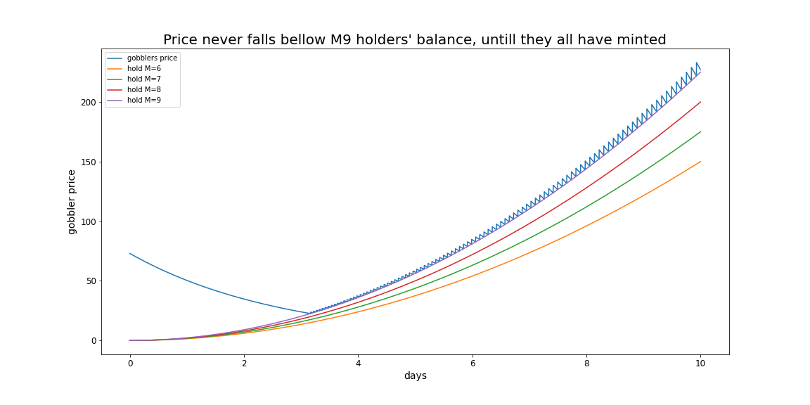

# VoltronGobblers

> Let's Go, Voltron Gobbler Force!

## Overview

**Let's explain VoltronGobblers!**

**Gobblers holders with weights 6,7,8 cannot afford new Gobblers even long after minting has started!!!**
**Here is the reason and solution!!**

A special kind of Gobblers (check this [artical](https://www.paradigm.xyz/2022/09/artgobblers) for ArtGobblers). The most special thing about VoltronGobblers is that it can be formed together, and there will be stronger ones.

According to the rules of Gobblers, on the 1st day 2,000 whitelisted users will be able to claim Gobblers before using Goo to mint Gobblers. Each Gobblers will be randomly assigned a weight factor after minting including four weight multiples (6, 7, 8, 9). Weight multiples will affect the speed of Goo generation. Holders of weight-9 will have a first-mover advantage.



As shown in the figure above, if there are holders with different weights, on the 10th day, the total difference ratio among Goo holders reach about 50% between weight-9 & weight-6 holders, **Gobblers holders with weights 6,7,8 cannot afford new Gobblers even long after minting has started..** (See [GobblersSimulation.ipynb](./analysis/GobblersSimulation.ipynb) for more details).

The blue line in the above chart is the simulated price of Gobblers. For the first 3.2 days, no one can afford buying Gobblers with Goo, so the price will drop rapidly from the starting price, and holders of weight-9 can afford it and start generating the first price of Gobblers buying. After the first trade, the price will rise and then fall again according to [VRGDAs](https://www.paradigm.xyz/2022/08/vrgda), the second weight-9 holder will mint the second gobblers, then the third, then the fourth...

According to rarity of Gobblers' weight, there will be 407 holders of weight-9 among the initial 2000 holders. If they all want the second Gobbler, holders of weight-8 may have to wait until the second month for the price up and up and they cannot afford while weight-9 holders can, not to mention holders with lower weights...

So, what should we do?

Let's Voltron together!

**The VoltronGobblers can make Gobblers with lower weights merging together and weighting higher to generate new Gobblers in advance, so Voltron members will get more gobblers!**.

## How it works

1. Users deposit their gobblers in Voltron.
2. Voltron will record the goo generated for each user, which is called `virtualBalance`.
3. All the Goo stored in Voltron are used to mint new Gobblers with the `mintVoltronGobblers()` function, which can be called by anyone.
4. New Gobblers in Voltron can be fairly distributed according to the proportion of the number of user's `virtualBalance`

## Quick Start

install

```sh
forge install
```

test

```sh
forge test
```

## VRGDAs 3D animation

[](https://www.youtube.com/watch?v=3wM2KcMUtE0)

click to watch animation
